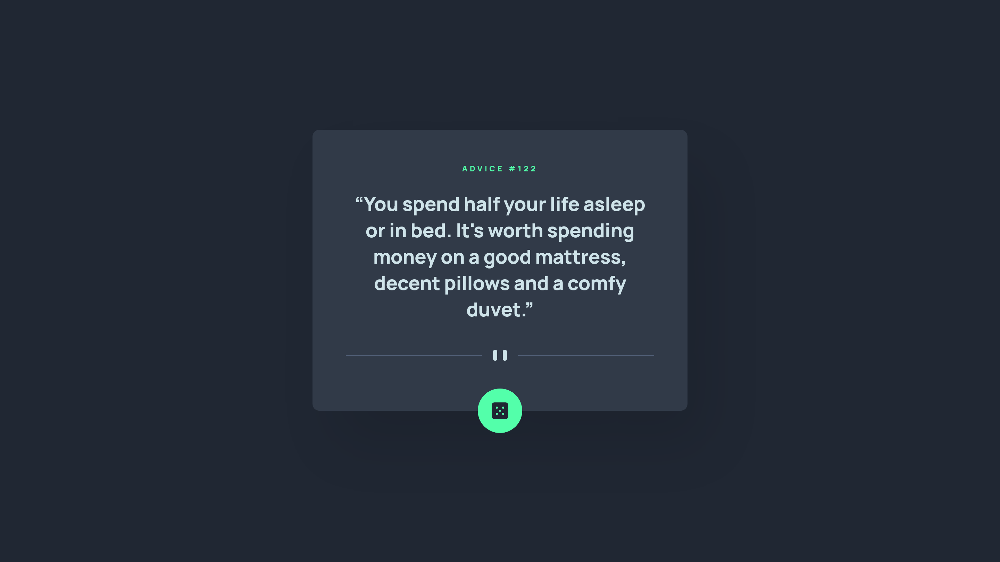

# Frontend Mentor - Advice generator app solution

This is a solution to the [Advice generator app challenge on Frontend Mentor](https://www.frontendmentor.io/challenges/advice-generator-app-QdUG-13db). Frontend Mentor challenges help you improve your coding skills by building realistic projects.

## Table of contents

- [Overview](#overview)
  - [The challenge](#the-challenge)
  - [Screenshot](#screenshot)
  - [Links](#links)
- [My process](#my-process)
  - [Built with](#built-with)
  - [What I learned](#what-i-learned)
  - [Continued development](#continued-development)
- [Author](#author)
- [License](#license)

## Overview

### The challenge

Users should be able to:

- View the optimal layout for the app depending on their device's screen size
- See hover states for all interactive elements on the page
- Generate a new piece of advice by clicking the dice icon

### Screenshot

| Mobile (375px) | Desktop (1440px) |
| --- | --- |
|  |  |

### Links

- [Solution URL](https://github.com/elidrissidev/advice-generator-app)
- [Live Site URL](https://advice-generator-app-elidrissidev.vercel.app)

## My process

### Built with

- Semantic HTML5 markup
- CSS custom properties
- Flexbox
- Mobile-first workflow
- [React](https://reactjs.org/) - JS library

### What I learned

This was an exciting challenge, I was able to use `react-query` for the first time to fetch the advice from the API and cache it, as well as handle the loading state. This is also the first time I test my work properly by insuring I mock the neccessary parts, like API endpoints.

### Continued development

Testing, testing, and testing. Yeah, I need to get better at it. It was also a bit difficult to handle error state for refetches in `react-query`, so I'd like to understand that more in the future.

## Author

- Website - [Mohamed ELIDRISSI](https://elidrissi.dev)
- Frontend Mentor - [@elidrissidev](https://www.frontendmentor.io/profile/elidrissidev)
- Twitter - [@elidrissidev](https://www.twitter.com/elidrissidev)

## License

This project is licensed under the [MIT License](LICENSE).
